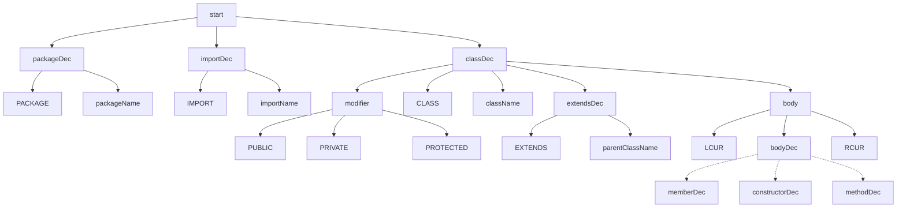

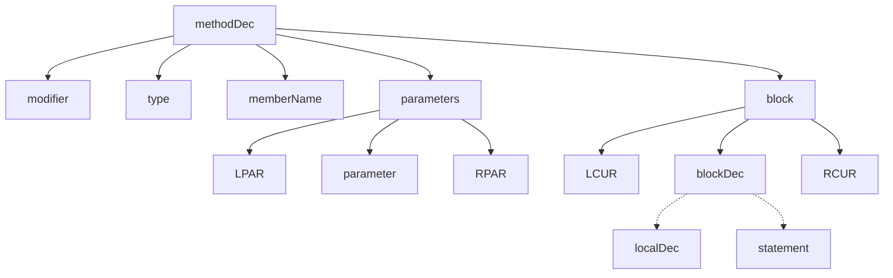

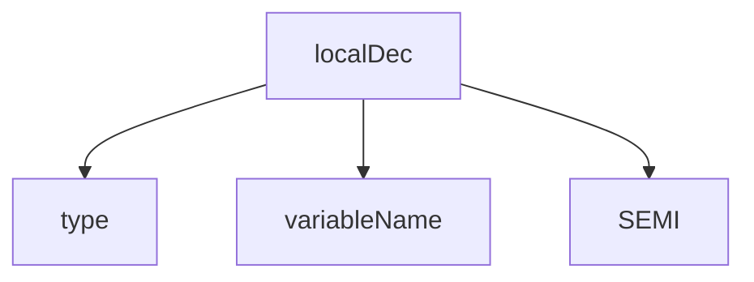

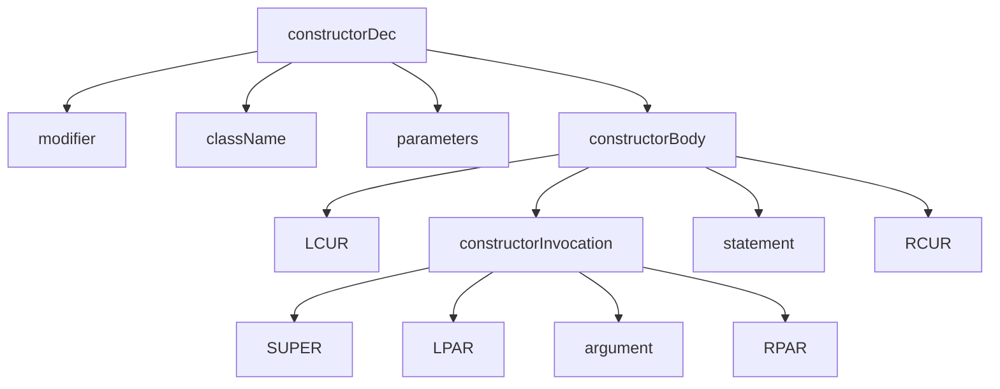

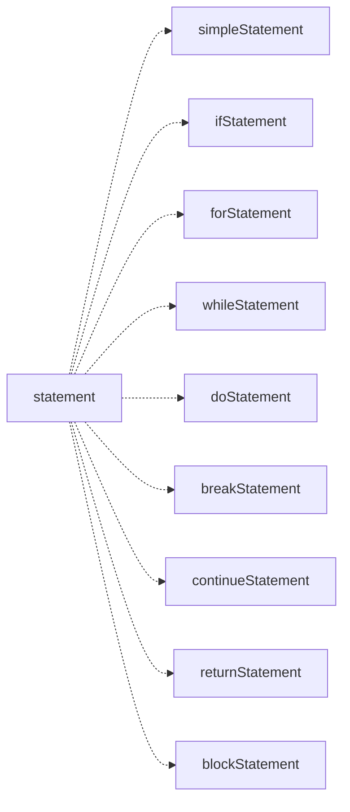

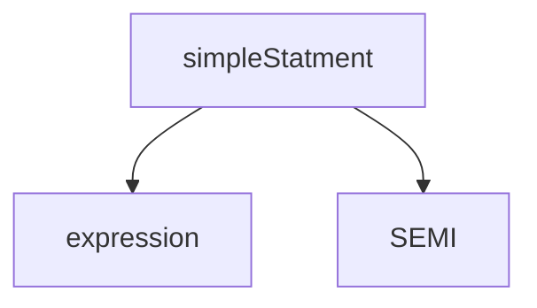

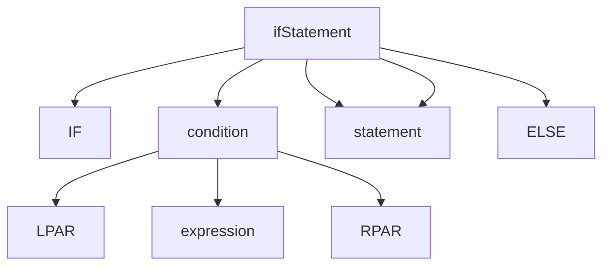

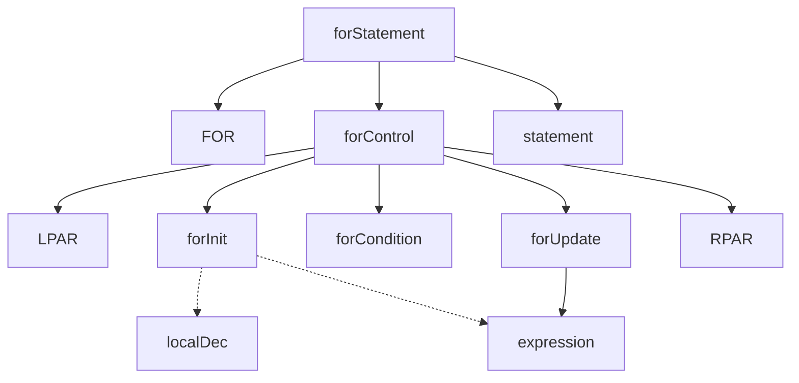

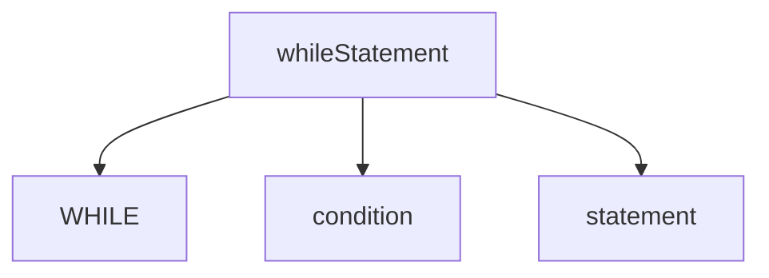

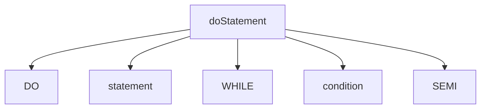

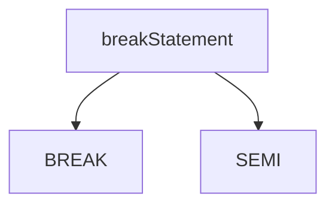

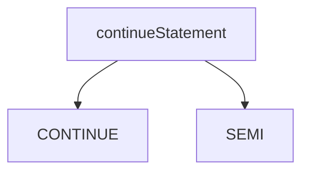

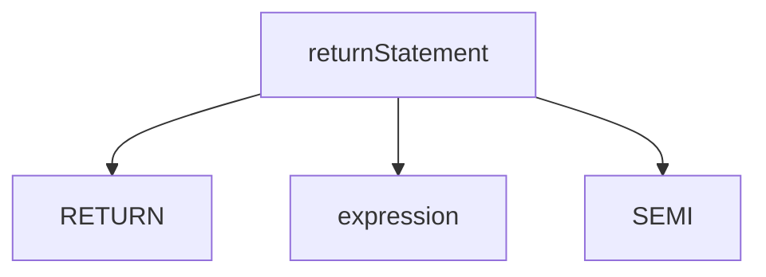

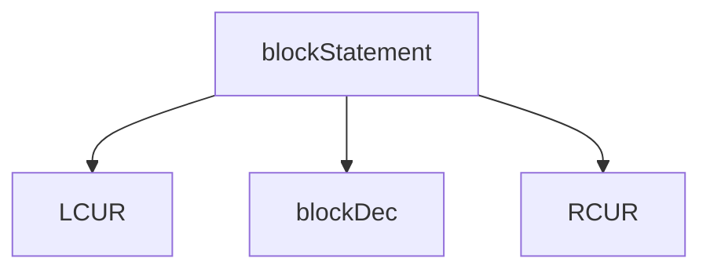

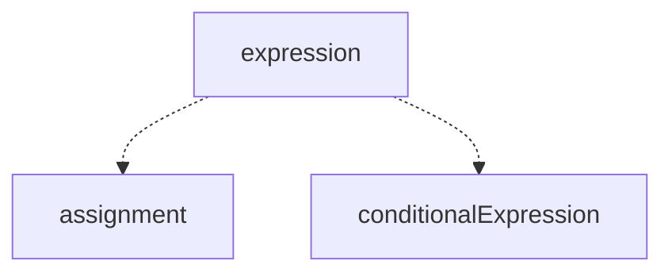

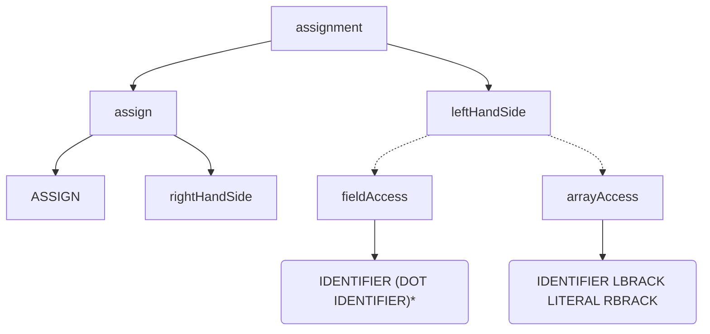

```mermaid
graph TD
    rightHandSide -.-> conditionalExpression
    rightHandSide -.-> primaryExpression

    conditionalExpression --> orExpression (QUESTION expression COLON expression)?;
```
